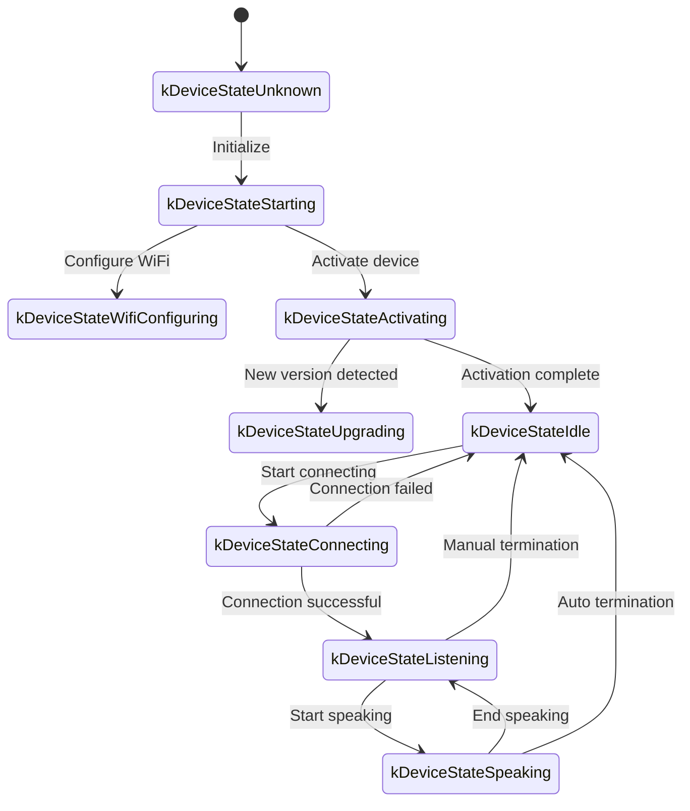
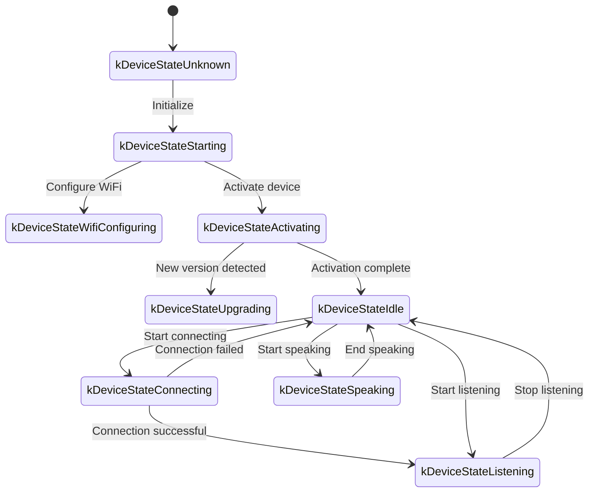

# WebSocket Communication Protocol Documentation

The following is a WebSocket communication protocol document based on code implementation, outlining how devices interact with servers via WebSocket.

This document is only inferred from the provided code and may need further confirmation or supplementation when actually deployed with server-side implementation.

---

## 1. Overall Process Overview

1. **Device Initialization**  
   - Device powers on, initializes `Application`:  
     - Initialize audio codec, display, LED, etc.  
     - Connect to network  
     - Create and initialize WebSocket protocol instance (`WebsocketProtocol`) implementing the `Protocol` interface  
   - Enter main loop waiting for events (audio input, audio output, scheduled tasks, etc.).

2. **Establish WebSocket Connection**  
   - When the device needs to start a voice session (e.g., user wake-up, manual button trigger, etc.), call `OpenAudioChannel()`:  
     - Get WebSocket URL from configuration
     - Set several request headers (`Authorization`, `Protocol-Version`, `Device-Id`, `Client-Id`)  
     - Call `Connect()` to establish WebSocket connection with server  

3. **Device Sends "hello" Message**  
   - After connection succeeds, device sends a JSON message, example structure below:  
   ```json
   {
     "type": "hello",
     "version": 1,
     "features": {
       "mcp": true
     },
     "transport": "websocket",
     "audio_params": {
       "format": "opus",
       "sample_rate": 16000,
       "channels": 1,
       "frame_duration": 60
     }
   }
   ```
   - The `features` field is optional, content generated automatically based on device compilation configuration. For example: `"mcp": true` indicates MCP protocol support.
   - `frame_duration` value corresponds to `OPUS_FRAME_DURATION_MS` (e.g., 60ms).

4. **Server Replies "hello"**  
   - Device waits for server to return a JSON message containing `"type": "hello"` and checks if `"transport": "websocket"` matches.  
   - Server may optionally send `session_id` field, which device automatically records upon receipt.  
   - Example:
   ```json
   {
     "type": "hello",
     "transport": "websocket",
     "session_id": "xxx",
     "audio_params": {
       "format": "opus",
       "sample_rate": 24000,
       "channels": 1,
       "frame_duration": 60
     }
   }
   ```
   - If matching, server is considered ready and audio channel is marked as successfully opened.  
   - If no correct reply received within timeout (default 10 seconds), connection is considered failed and network error callback is triggered.

5. **Subsequent Message Interaction**  
   - Device and server can send two main types of data:  
     1. **Binary Audio Data** (Opus encoded)  
     2. **Text JSON Messages** (for transmitting chat status, TTS/STT events, MCP protocol messages, etc.)  

   - In code, receive callbacks are mainly divided into:  
     - `OnData(...)`:  
       - When `binary` is `true`, considered as audio frame; device will decode it as Opus data.  
       - When `binary` is `false`, considered as JSON text, needs to be parsed with cJSON on device side and processed according to corresponding business logic (like chat, TTS, MCP protocol messages, etc.).  

   - When server or network disconnects, `OnDisconnected()` callback is triggered:  
     - Device calls `on_audio_channel_closed_()` and eventually returns to idle state.

6. **Close WebSocket Connection**  
   - When device needs to end voice session, it calls `CloseAudioChannel()` to actively disconnect and return to idle state.  
   - Or if server actively disconnects, it will trigger the same callback process.

---

## 2. Common Request Headers

When establishing WebSocket connection, the code example sets the following request headers:

- `Authorization`: Used to store access token, formatted as `"Bearer <token>"`  
- `Protocol-Version`: Protocol version number, consistent with the `version` field in hello message body  
- `Device-Id`: Device physical network card MAC address
- `Client-Id`: Software-generated UUID (will reset when NVS is erased or complete firmware is re-flashed)

These headers are sent to the server along with the WebSocket handshake, and the server can perform verification, authentication, etc. as needed.

---

## 3. Binary Protocol Versions

The device supports multiple binary protocol versions, specified through the `version` field in configuration:

### 3.1 Version 1 (Default)
Directly sends Opus audio data with no additional metadata. WebSocket protocol distinguishes between text and binary.

### 3.2 Version 2
Uses `BinaryProtocol2` structure:
```c
struct BinaryProtocol2 {
    uint16_t version;        // Protocol version
    uint16_t type;           // Message type (0: OPUS, 1: JSON)
    uint32_t reserved;       // Reserved field
    uint32_t timestamp;      // Timestamp (milliseconds, for server-side AEC)
    uint32_t payload_size;   // Payload size (bytes)
    uint8_t payload[];       // Payload data
} __attribute__((packed));
```

### 3.3 Version 3
Uses `BinaryProtocol3` structure:
```c
struct BinaryProtocol3 {
    uint8_t type;            // Message type
    uint8_t reserved;        // Reserved field
    uint16_t payload_size;   // Payload size
    uint8_t payload[];       // Payload data
} __attribute__((packed));
```

---

## 4. JSON Message Structure

WebSocket text frames are transmitted in JSON format. The following are common `"type"` fields and their corresponding business logic. If a message contains unlisted fields, they may be optional or implementation-specific details.

### 4.1 Device → Server

1. **Hello**  
   - Sent by device after successful connection to inform server of basic parameters.  
   - Example:
     ```json
     {
       "type": "hello",
       "version": 1,
       "features": {
         "mcp": true
       },
       "transport": "websocket",
       "audio_params": {
         "format": "opus",
         "sample_rate": 16000,
         "channels": 1,
         "frame_duration": 60
       }
     }
     ```

2. **Listen**  
   - Indicates device starts or stops recording/listening.  
   - Common fields:  
     - `"session_id"`: Session identifier  
     - `"type": "listen"`  
     - `"state"`: `"start"`, `"stop"`, `"detect"` (wake detection triggered)  
     - `"mode"`: `"auto"`, `"manual"` or `"realtime"`, indicating recognition mode.  
   - Example: Start listening  
     ```json
     {
       "session_id": "xxx",
       "type": "listen",
       "state": "start",
       "mode": "manual"
     }
     ```

3. **Abort**  
   - Terminate current speech (TTS playback) or voice channel.  
   - Example:
     ```json
     {
       "session_id": "xxx",
       "type": "abort",
       "reason": "wake_word_detected"
     }
     ```
   - `reason` value can be `"wake_word_detected"` or others.

4. **Wake Word Detected**  
   - Used for device to inform server that wake word is detected.
   - Before sending this message, wake word Opus audio data can be sent in advance for server voice print detection.  
   - Example:
     ```json
     {
       "session_id": "xxx",
       "type": "listen",
       "state": "detect",
       "text": "Hello Xiaoming"
     }
     ```

5. **MCP**
   - Recommended next-generation protocol for IoT control. All device capability discovery, tool invocation, etc. are conducted through type: "mcp" messages, with payload internally being standard JSON-RPC 2.0 (see [MCP Protocol Documentation](./mcp-protocol.md) for details).
   
   - **Example of device sending result to server:**
     ```json
     {
       "session_id": "xxx",
       "type": "mcp",
       "payload": {
         "jsonrpc": "2.0",
         "id": 1,
         "result": {
           "content": [
             { "type": "text", "text": "true" }
           ],
           "isError": false
         }
       }
     }
     ```

---

### 4.2 Server → Device

1. **Hello**  
   - Handshake confirmation message returned by server.  
   - Must include `"type": "hello"` and `"transport": "websocket"`.  
   - May include `audio_params`, indicating server's expected audio parameters or configuration aligned with device.   
   - Server can optionally send `session_id` field, which device will automatically record upon receipt.  
   - After successful receipt, device will set event flag indicating WebSocket channel is ready.

2. **STT**  
   - `{"session_id": "xxx", "type": "stt", "text": "..."}`
   - Indicates server has recognized user speech (e.g., speech-to-text result)  
   - Device may display this text on screen, then proceed to response flow.

3. **LLM**  
   - `{"session_id": "xxx", "type": "llm", "emotion": "happy", "text": "😀"}`
   - Server instructs device to adjust emotion animation/UI expression.  

4. **TTS**  
   - `{"session_id": "xxx", "type": "tts", "state": "start"}`: Server prepares to send TTS audio, device enters "speaking" playback state.  
   - `{"session_id": "xxx", "type": "tts", "state": "stop"}`: Indicates current TTS session ends.  
   - `{"session_id": "xxx", "type": "tts", "state": "sentence_start", "text": "..."}`
     - Lets device display current text segment to be played or read on interface (e.g., for user display).  

5. **MCP**
   - Server sends IoT-related control commands or returns call results through type: "mcp" messages, with same payload structure as above.
   
   - **Example of server sending tools/call to device:**
     ```json
     {
       "session_id": "xxx",
       "type": "mcp",
       "payload": {
         "jsonrpc": "2.0",
         "method": "tools/call",
         "params": {
           "name": "self.light.set_rgb",
           "arguments": { "r": 255, "g": 0, "b": 0 }
         },
         "id": 1
       }
     }
     ```

6. **System**
   - System control commands, commonly used for remote upgrade updates.
   - Example:
     ```json
     {
       "session_id": "xxx",
       "type": "system",
       "command": "reboot"
     }
     ```
   - Supported commands:
     - `"reboot"`: Restart device

7. **Custom** (Optional)
   - Custom messages, supported when `CONFIG_RECEIVE_CUSTOM_MESSAGE` is enabled.
   - Example:
     ```json
     {
       "session_id": "xxx",
       "type": "custom",
       "payload": {
         "message": "Custom content"
       }
     }
     ```

8. **Audio Data: Binary Frames**  
   - When server sends audio binary frames (Opus encoded), device decodes and plays them.  
   - If device is in "listening" (recording) state, received audio frames will be ignored or cleared to prevent conflicts.

---

## 5. Audio Encoding/Decoding

1. **Device Sends Recording Data**  
   - Audio input, after possible echo cancellation, noise reduction, or volume gain, is Opus-encoded and packaged as binary frames sent to server.  
   - Depending on protocol version, may directly send Opus data (version 1) or use binary protocol with metadata (version 2/3).

2. **Device Plays Received Audio**  
   - When receiving binary frames from server, they are also considered Opus data.  
   - Device will decode and then pass to audio output interface for playback.  
   - If server's audio sampling rate differs from device, resampling will occur after decoding.

---

## 6. Common State Transitions

The following are common device key state transitions corresponding to WebSocket messages:

1. **Idle** → **Connecting**  
   - After user trigger or wake-up, device calls `OpenAudioChannel()` → establish WebSocket connection → send `"type":"hello"`.  

2. **Connecting** → **Listening**  
   - After successful connection, if continuing to execute `SendStartListening(...)`, enter recording state. Device will continuously encode microphone data and send to server.  

3. **Listening** → **Speaking**  
   - Receive server TTS Start message (`{"type":"tts","state":"start"}`) → stop recording and play received audio.  

4. **Speaking** → **Idle**  
   - Server TTS Stop (`{"type":"tts","state":"stop"}`) → audio playback ends. If not continuing to auto-listen, return to Idle; if configured for auto-loop, re-enter Listening.  

5. **Listening** / **Speaking** → **Idle** (encountering exception or active interruption)  
   - Call `SendAbortSpeaking(...)` or `CloseAudioChannel()` → interrupt session → close WebSocket → state returns to Idle.  

### Auto Mode State Transition Diagram



### Manual Mode State Transition Diagram



---

## 7. Error Handling

1. **Connection Failure**  
   - If `Connect(url)` returns failure or times out while waiting for server "hello" message, triggers `on_network_error_()` callback. Device will prompt "Unable to connect to service" or similar error message.

2. **Server Disconnect**  
   - If WebSocket disconnects abnormally, callback `OnDisconnected()`:  
     - Device callbacks `on_audio_channel_closed_()`  
     - Switch to Idle or other retry logic.

---

## 8. Other Considerations

1. **Authentication**  
   - Device provides authentication by setting `Authorization: Bearer <token>`, server needs to verify validity.  
   - If token expires or is invalid, server can reject handshake or disconnect subsequently.

2. **Session Control**  
   - Some messages in code contain `session_id`, used to distinguish independent conversations or operations. Server can separate different sessions as needed.

3. **Audio Payload**  
   - Code defaults to Opus format with `sample_rate = 16000`, mono. Frame duration controlled by `OPUS_FRAME_DURATION_MS`, generally 60ms. Can be adjusted based on bandwidth or performance. For better music playback, server downstream audio may use 24000 sample rate.

4. **Protocol Version Configuration**  
   - Configure binary protocol version (1, 2, or 3) through `version` field in settings
   - Version 1: Direct Opus data transmission
   - Version 2: Binary protocol with timestamps, suitable for server-side AEC
   - Version 3: Simplified binary protocol

5. **IoT Control Recommends MCP Protocol**  
   - IoT capability discovery, status synchronization, control commands, etc. between device and server are recommended to be implemented entirely through MCP protocol (type: "mcp"). The original type: "iot" solution is deprecated.
   - MCP protocol can be transmitted over various underlying protocols like WebSocket, MQTT, etc., providing better extensibility and standardization.
   - For detailed usage, please refer to [MCP Protocol Documentation](./mcp-protocol.md) and [MCP IoT Control Usage](./mcp-usage.md).

6. **Error or Malformed JSON**  
   - When JSON lacks necessary fields, e.g., `{"type": ...}`, device will log error (`ESP_LOGE(TAG, "Missing message type, data: %s", data);`) and execute no business logic.

---

## 9. Message Examples

Here's a typical bidirectional message example (simplified flow illustration):

1. **Device → Server** (handshake)
   ```json
   {
     "type": "hello",
     "version": 1,
     "features": {
       "mcp": true
     },
     "transport": "websocket",
     "audio_params": {
       "format": "opus",
       "sample_rate": 16000,
       "channels": 1,
       "frame_duration": 60
     }
   }
   ```

2. **Server → Device** (handshake response)
   ```json
   {
     "type": "hello",
     "transport": "websocket",
     "session_id": "xxx",
     "audio_params": {
       "format": "opus",
       "sample_rate": 16000
     }
   }
   ```

3. **Device → Server** (start listening)
   ```json
   {
     "session_id": "xxx",
     "type": "listen",
     "state": "start",
     "mode": "auto"
   }
   ```
   Meanwhile, device starts sending binary frames (Opus data).

4. **Server → Device** (ASR result)
   ```json
   {
     "session_id": "xxx",
     "type": "stt",
     "text": "What user said"
   }
   ```

5. **Server → Device** (TTS start)
   ```json
   {
     "session_id": "xxx",
     "type": "tts",
     "state": "start"
   }
   ```
   Then server sends binary audio frames to device for playback.

6. **Server → Device** (TTS end)
   ```json
   {
     "session_id": "xxx",
     "type": "tts",
     "state": "stop"
   }
   ```
   Device stops playing audio, returns to idle state if no more commands.

---

## 10. Summary

This protocol transmits JSON text and binary audio frames over WebSocket to complete functions including audio stream upload, TTS audio playback, speech recognition and state management, MCP command delivery, etc. Its core features:

- **Handshake Phase**: Send `"type":"hello"`, wait for server return.  
- **Audio Channel**: Bidirectional transmission of voice streams using Opus-encoded binary frames, supporting multiple protocol versions.  
- **JSON Messages**: Use `"type"` as core field to identify different business logic, including TTS, STT, MCP, WakeWord, System, Custom, etc.  
- **Extensibility**: Can add fields to JSON messages or perform additional authentication in headers as needed.

Server and device need to agree in advance on field meanings, timing logic, and error handling rules for various message types to ensure smooth communication. The above information can serve as foundational documentation for subsequent integration, development, or extension.